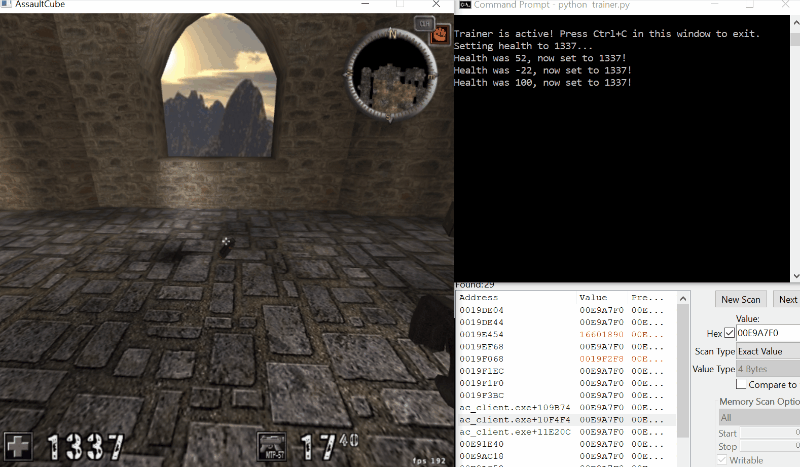
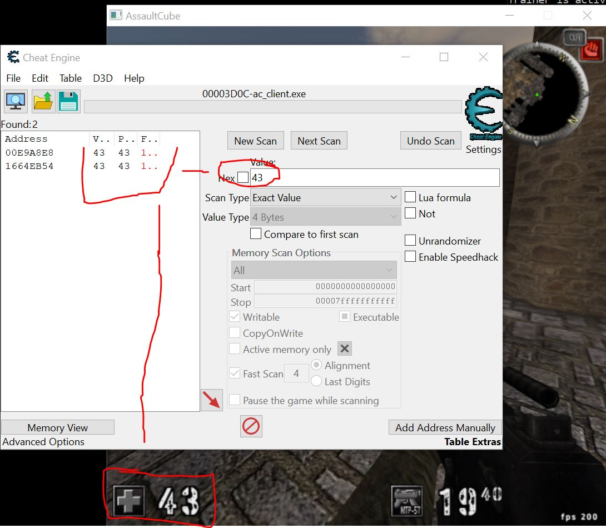
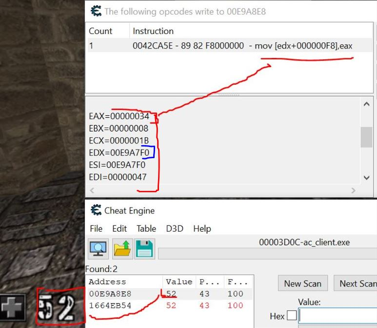
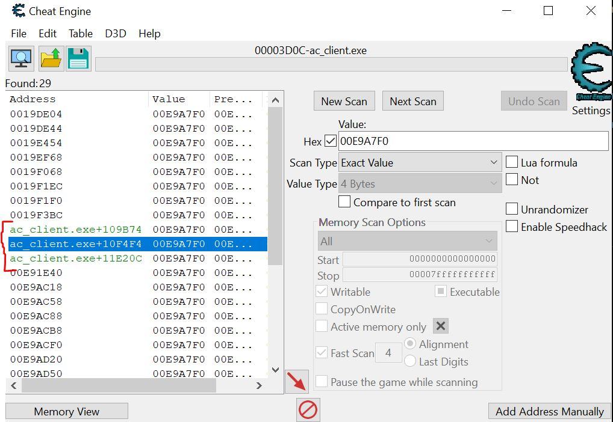

# Giving an Old Game a Go: A Memory Manipulation Project

## What's the story?

I had a poke around inside an old PC game, Assault Cube, to see how it ticks. The goal was to figure out where it keeps the player's health in memory and then write a small Python script—a "trainer"—to make the player invincible.

## Skills I Had to Use
*   **Reverse Engineering:** Figuring out the game's logic just by looking at its memory.
*   **Debugging:** Using a debugger to see the game's code in action as it ran.
*   **Memory Analysis:** Knowing the difference between a memory address that changes every time (dynamic) and one that's a sure thing (static).
*   **Tool Development:** Knocking together a script in Python to do the heavy lifting for me.
*   **OS Fundamentals:** A bit of practical knowledge about how programs are laid out in memory.

## The Tools for the Job
*   **The Target:** Assault Cube v1.2.0.2 (an old reliable).
*   **The Toolkit:** Cheat Engine.
*   **The Scripting Language:** Python 3 with the `pymem` library.

---

## The Grand Finale: The Trainer in Action

A GIF is worth a million words.



---

## How It Was Done

It was a two-part job: first, a bit of detective work to find the clues, and secondly, building the tool to use those clues.

### Part 1: The Detective Work (The RE Phase)

The whole challenge is that the health value moves to a new spot in memory every time you start the game. You can't just find it once; you have to find the permanent set of directions to it.

**1. Finding Where the Health Lives (For Now)**
First, I had to track down the health value in the current game. A quick scan for 100, take a hit, scan for the new number, and repeat until I had it cornered.



**2. Finding the Culprit**
With the health address found, I set a trap with the debugger to see what part of the game's code was changing it. After taking a hit, the culprit showed itself.



The instruction captured was `mov [edx+000000F8], eax`. This was the key, telling me: "The player's info is at the address in the `EDX` register, and the health is exactly `F8` steps away from there."

**3. Finding the Permanent Signpost**
The address in `EDX` still changes every time, so I did one last search for that address. This gave me a few static (green) pointers that never change. The main one was `ac_client.exe+10F4F4`, the permanent signpost I was looking for.



### Part 2: Building the Tool (The Python Script)

With the hard part done and my clues in hand (`ac_client.exe+10F4F4` and `0xF8`), it was time to get the Python script sorted. Using the `pymem` library, the script does the following:

*   Hooks into the game process.
*   Finds the base address of the game module.
*   Follows the "signpost" and the "directions" to find the health address in a loop.
*   Keeps writing `1337` to that address, making me a certified tank in the game.

```python
# Here's the brains of the operation.
import pymem
import pymem.process
import time

# --- CONFIGURATION ---
# The clues found earlier!
PROCESS_NAME = "ac_client.exe"
BASE_POINTER_OFFSET = 0x10F4F4
HEALTH_OFFSET = 0xF8

GOD_MODE_HEALTH = 1337

def main():
    print("Searching for game process...")
    try:
        pm = pymem.Pymem(PROCESS_NAME)
        print(f"Successfully attached to process: {PROCESS_NAME}")
    except pymem.exception.ProcessNotFound:
        print(f"Process not found. Please make sure '{PROCESS_NAME}' is running.")
        return

    try:
        module_base = pymem.process.module_from_name(pm.process_handle, PROCESS_NAME).lpBaseOfDll
        print(f"Base address of {PROCESS_NAME} found at: {hex(module_base)}")
    except AttributeError:
        print(f"Could not find module '{PROCESS_NAME}'. Exiting.")
        return

    print("\nTrainer is active! Press Ctrl+C in this window to exit.")

    try:
        while True:
            try:
                player_base_addr = pm.read_int(module_base + BASE_POINTER_OFFSET)
                health_addr = player_base_addr + HEALTH_OFFSET
                current_health = pm.read_int(health_addr)
                
                if current_health > 0 and current_health < GOD_MODE_HEALTH:
                    pm.write_int(health_addr, GOD_MODE_HEALTH)
            
            except pymem.exception.MemoryReadError:
                pass
            
            time.sleep(0.1)

    except KeyboardInterrupt:
        print("Trainer deactivated. Exiting.")

if __name__ == '__main__':
    main()