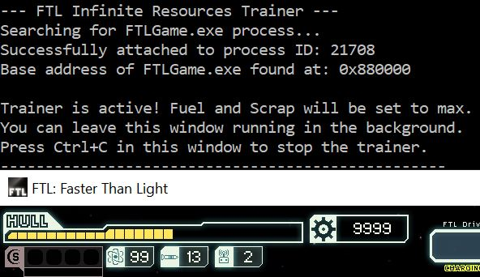
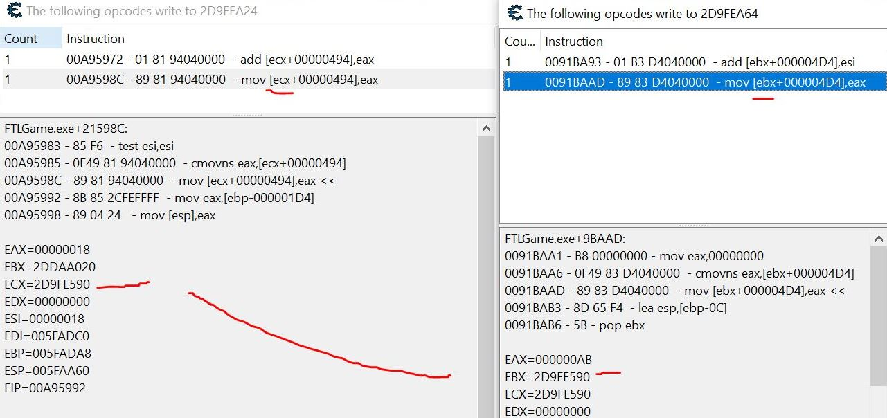
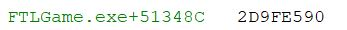
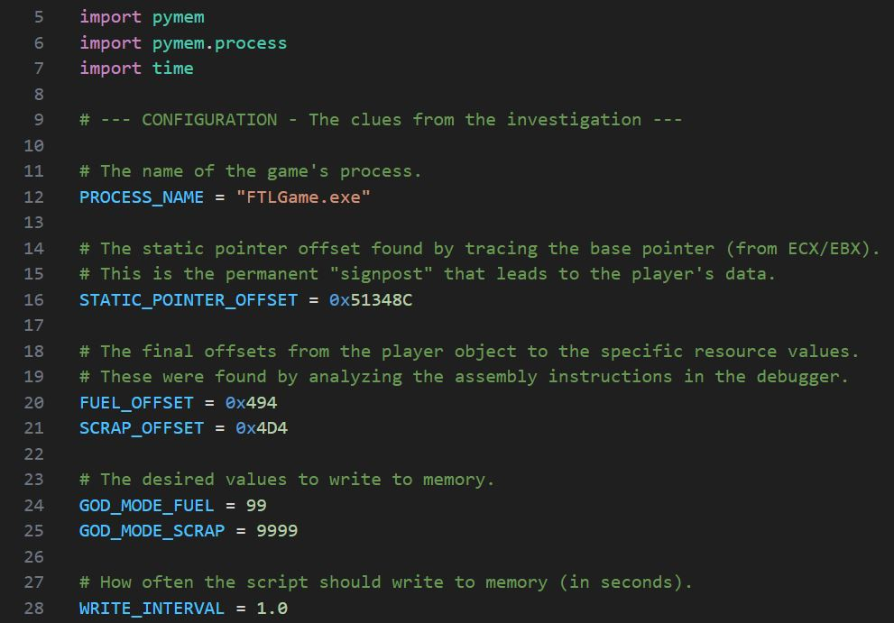

# FTL: Don't Mind Me, Just Topping Up the Tank

## So, What's the Story?

I had a go at a deadly little game called *FTL: Faster Than Light*. One of my favourites. It's a grand game, but you're always one stray asteroid away from being out of fuel and scrap, floating aimlessly in the void like a crisp packet in the wind.

The plan was to write a simple Python script a "trainer" to make my space faring adventures a bit more... comfortable.

## The Skills I Had to Use (And a Bit of Luck)

*   **Reverse Engineering:** Figuring out how the game keeps its books without a manual.
*   **Memory Analysis:** Spotting the difference between the number the game *shows* you and the one it *actually* uses. A classic bit of smoke and mirrors.
*   **Debugging:** Playing detective with the game's code to see which part was pinching my scrap.
*   **Tool Development:** Knocking together a Python script to do the heavy lifting for me.

## The Tools for the Job

*   **The Target:** FTL: Faster Than Light.
*   **The Toolkit:** Cheat Engine.
*   **The Scripting Language:** Python 3 with the mighty `pymem` library.

---

## The Grand Finale: The Trainer in Action

A picture is worth a thousand words. Here's the script making sure I'm never short on cash or petrol.

---

## How It Was All Done

### Part 1: The Detective Work (Finding the Good Stuff)

The main challenge was that the game is a wily one. It doesn't just have one number for your scrap; it has a "real" value and a "display" value. A classic trick to throw you off the scent.

**1. Finding the Real Scrap (Not the Decoy)**
First, I had to find the actual memory address for Scrap. I found a couple of addresses, but changing one of them only made the game's UI have a bit of a panic before resetting. This was the decoy. The other one, the "real" one, was the key.

**2. Finding the Culprit**
With the real Scrap address found, I set a trap with the debugger to see what part of the game's code was changing it. After earning a bit of scrap, the culprit showed itself. It was a `mov [ecx+000004D4],eax` instruction. This was the golden clue, telling me: "Your ship's info is at the address in the `ECX` register, and the Scrap is exactly `4D4` steps away from there."

> **Fig. 1:** Catching the code red-handed.

**3. Finding the Permanent Signpost**
The address in `ECX` still changes every time you start the game, so I did one last search for *that* address. This gave me a beautiful, static (green) pointer that never changes: `FTLGame.exe+51348C`. This was the permanent signpost I was looking for.

> **Fig. 2:** The final piece of the puzzle. This green address is the "X" that marks the spot.

I repeated the same process for Fuel and found it was part of the same data structure, just at a different offset. Job done.

### Part 2: Building the Tool (The Python Bit)

With all the clues in hand (`FTLGame.exe+51348C`, `0x4D4` for Scrap, and `0x494` for Fuel), it was time to get the Python script sorted. Using the `pymem` library, the script does a simple job:

*   Hooks into the FTL game process.
*   Finds the base address of the game.
*   Follows the "signpost" and the "directions" to find the real addresses for Fuel and Scrap.
*   Keeps writing a ridiculously high number to those addresses, making me the richest (and most mobile) captain in the galaxy.

## What I Reckon in the End

This was a grand project. It's a perfect example of how even a simple looking game has a few tricks up its sleeve. It really hammered home the difference between what you see on screen and what's actually happening under the hood. All in all, a good day's work. Now, if you'll excuse me, I have a ridiculously well funded spaceship to fly.

## Where Could We Go From Here? (Future Work)

While this trainer successfully handles Fuel and Scrap, the investigation opened up a few doors for more advanced projects. Given more time, the next logical steps would be:

*   **Mapping the Full Ship Structure:** The same base pointer (`FTLGame.exe+51348C`) could be used to find offsets for other critical resources like Drone Parts, Missiles, and even the ship's Hull integrity.
*   **Creating a "No Miss" Trainer:** This would involve a more advanced technique. Instead of changing a data value, the goal would be to find the assembly code that handles weapon-hit calculations and use **code patching** to modify the game's logic, forcing every shot to be a guaranteed hit.
*   **Crew Stat Editor:** A much deeper challenge would be to reverse engineer the data structures for each crew member. The goal would be to find and modify individual skill levels (Piloting, Engines, Shields, etc.), which would likely involve tracing more complex, multi-level pointer chains.

**This project was conducted for purely educational purposes.** The goal was to deconstruct a single-player, offline game to learn about its memory structure and apply reverse engineering techniques. The tools and methods described here are not intended for use in any multi-player environment or to gain an unfair advantage in a competitive setting. Always respect the game developers and the community!