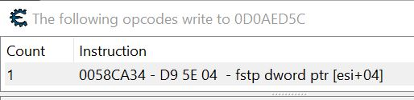
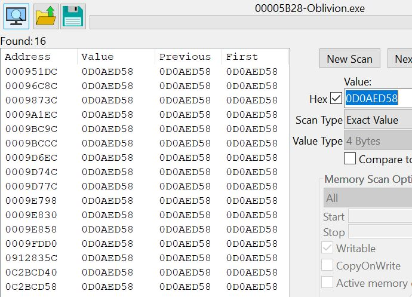

**Having a Look at Elder Scrolls Oblivion: A Reverse Engineering Case Study in Client-Side Analysis**

*Whats the Story?*

The plan was simple: have a look around inside a classic game, The Elder Scrolls IV: Oblivion, and see if I could whip up a quick Python script to give myself infinite health. A grand little project, I thought. Be in and out before the kettle boils.

The game had other ideas. What started as a straightforward job turned into a proper cat & mouse game. The game was the mouse, darting around its memory like a mad thing & I was the cat, getting increasingly confused and considering just having a nap in a sunbeam. This is the story of that chase.

## The Skills I Had to Dig Out of the Shed

*   **Reverse Engineering:** Trying to figure out the game's logic when all it wants to do is play catch me if you can.
*   **Debugging:** Wrestling with three different types of debuggers (Windows, VEH, and a stubborn Kernel-mode one) to find one that the game would tolerate.
*   **Memory Analysis:** Knowing the difference between a float, an integer, and a kick in the teeth.
*   **Disassembly:** Learning to read the game's secret language (x86 Assembly) to find out what it's *really* thinking.
*   **Problem-Solving:** A fancy term for banging your head against a wall until the wall gives in.

## The Tools for the Job

*   **The Target:** Oblivion (Game of the Year Edition on Steam), a wily old fox.
*   **The Toolkit:** Cheat Engine 7.6 (my magnifying glass and lockpick set).
*   **My Brain:** Questionable at times, but we got there.

## The Investigation: A Tale of Woe and Wisdom

This wasn't a one-step job. This was a whole ordeal. Here’s how the chase went down.

### Chapter 1: The Case of the Vanishing Health

First things first, find the health. Scan for the number, take a hit, scan again. Except, it wasn't there. After chasing my own tail, I figured out the first trick: the health wasn't a simple number, it was a **Float**. A decimal number pretending to be a whole one. Clever girl.

> **Fig. 1:** Finally cornering the health value. Turns out it was wearing a disguise the whole time.

But here's the kicker: trying to change this number did absolutely nothing. It was a decoy. The game's real logic would just slap my hand away and write the correct value back over it. I wasn't just chasing a mouse, I was chasing its shadow.

### Chapter 2: The Game Fights Back (And My Tools Throw a Wobbly)

Right, new plan. If I can't change the data, I'll find the bit of code that's changing it and have a word. I set a trap with Cheat Engine's standard **Windows Debugger** to see what was writing to my decoy health address. The moment I sprang the trap... **the game crashed.** It had an anti-debugging system. This old dog had some new tricks.

I tried to bring out the stealth suit: the **Kernel-Mode Debugger (DBVM)**. But my machine threw a spanner in the works. The driver had pathing issues and wouldn't play ball.

Down but not out, I tried the third option: the **VEH (Vectored Exception Handling) Debugger**. This was the Goldilocks solution. Not as basic as the Windows one, not as deep as the Kernel one. And it worked. It was just right. The game didn't spot it. I was in.

### Chapter 3: The Smoking Gun

With the VEH Debugger running, I set the trap again. This time, no crash. I healed myself in-game and *bang*, I caught it red-handed.

> **Fig. 2:** The culprit. This one line of code, `fstp dword ptr [esi+04]`, was the key. It told me everything. The real health is a Float (`fstp`) at an offset of `+04` from a pointer stored in a register called `ESI`.

I now had the mouse by the tail. `ESI` was the key. It held the pointer to my player's real data. All I had to do was find where that `ESI` value came from.

### Chapter 4: The Final Plot Twist

I did one last scan. A grand, final search for a permanent, static signpost that pointed to the address in `ESI`. And the result?

**Nothing. Nada.**

> **Fig. 3:** The final scan. All that work, just to find out there's no permanent signpost. The pointer to my player is generated on the fly, dynamically.

This was the end of the road for my simple Python script. The game doesn't have a permanent address for the player that an external tool can just grab. The pointer is a ghost of a mouse, created and destroyed as needed, passed between functions like a secret note.

## So, What I Reckon in the End

This project was a brilliant lesson in humility. I went in expecting a quick win and got a masterclass in application defense and tool configuration. The real challenge wasn't just outsmarting the game, but outsmarting my own tools to find a debugger that could get the job done.

The big takeaway is that a simple memory-writing "trainer" just isn't on the cards for this game. The only way to properly get at the health is to go deeper & to perform **Code Injection**. You can't just change the numbers on the page, you have to sneak into the office and change the story itself.

And that sounds like a grand old project for another day.

---
> **Future Work:** The findings from this investigation will be used in **Project 2: Oblivion - Getting Away With It (A Code Injection Story)**, where I'll actually build the 'God Mode' cheat this game so desperately tried to stop me from making. 

### Disclaimer & Ethical Note

**This project was conducted for purely educational purposes.** The goal was to deconstruct a single-player game to understand its internal mechanics, memory management, and anti-debugging techniques. All analysis was performed offline on a legally owned copy of the game. The tools and knowledge gained here were not used to impact any multi-player environment or violate any terms of service.

### Best Practices for a Safe Investigation
To ensure a stable and safe environment that posed no risk to my game saves or online accounts, the following precautions were taken before any analysis began:

1.  **Run Offline** 
2.  **Disable Cloud Saves:** Steam's Cloud Saves for Oblivion were disabled to prevent any potential save file corruption from syncing.
3.  **Firewall Block (Optional but Recommended):** An outbound rule was created in the Windows Firewall to block `Oblivion.exe` from accessing the internet, providing an extra layer of isolation.
4.  **Work in a "Lab":** All investigation was conducted on a dedicated save file created *after* the heavily scripted tutorial sequence, ensuring analysis was performed on the game's normal, stable open-world state.